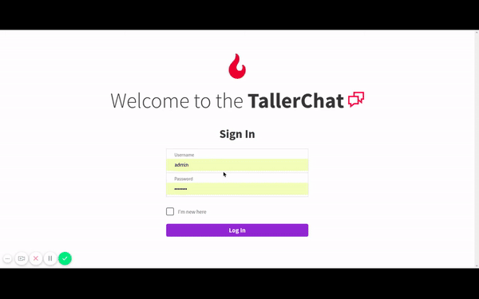
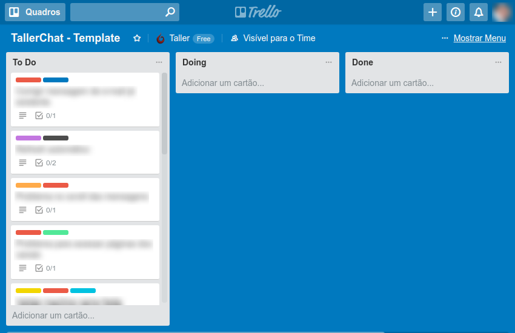

<p align="center">
  <a href="http://taller.net.br">
    
  </a>
</p>

<h1 align="center">
  <a href="http://taller.net.br">Taller</a>'s Chat Test
</h1>

<p align="center">A chat application that intends to beat Slack,<br />but is humble enough to understand this is never going to happen.</p>

## How will it work

The purpose of this test is to help us understand your technical proficiency and decision making process. You will install this application, check it out, and once it's up-and-running we will ask you to develop a couple of new features or apply some bug fixes.

## What will you need

This application consists of a [Drupal 8](http://drupal.org/) backend providing a [GraphQL](https://www.drupal.org/project/graphql) API which is consumed by [Apollo](https://www.apollographql.com/) on a [Next.js](https://github.com/zeit/next.js/) based [React](https://reactjs.org/) application.

> We do not expect you to have knowledge on all of these tools, but you'll probably need to study one or another to get some tasks done.

> Have a look at [STACK.md](./STACK.md) for more information on the technologies used.

### Requirements

To run it locally, you must have:

- [Docker](https://docs.docker.com/install/)
- [Docker Compose](https://docs.docker.com/compose/install/)
- Make

## Getting started

### 1. Clone this repository

You must git clone this project and re-publish it on your own GitHub account. **Do not fork this repository**; it would make it easy for other candidates to copy your solutions.

[](https://asciinema.org/a/ssOTM6HdlvNpVHWUrni2qBwGy)

### 2. Install & Run

This project relies on docker to setup the development environment and there are already some scripts available for common tasks on the Makefile at the root. Follow these steps to get started:

**Build the containers** :hammer:

[](https://asciinema.org/a/DevZistI3Een0TqVgdHC3jWir)

```sh
make run
```

**Grab a coffee** :coffee:

Big one. This takes a while.

> Don't have SSD? Take two coffees.

**See Drupal running** :droplet:

Access http://localhost

> **Credentials**<br />
> Username: _admin_<br />
> Password: _password_

**Start Next.js application** :fire:

[](https://asciinema.org/a/FPNKnxSqQoTXMSTqevt7NPqJE)

```
make in
cd next
yarn dev
```

> We use [yarn](https://yarnpkg.com/pt-BR/) instead of [npm](https://www.npmjs.com/). This is not necessary, but recommended.

**Access http://localhost:3000** :tada:

So far you should be able to login and add a couple of messages:

]

### 3. Have a look around

It is important that you have the development environment operational before we start. So take the time and study how things work on the application, maybe try to find some bugs on your own. If you have any trouble, please open an issue on this repository and we'll get back to you as soon as possible.

### 4. Let the games begin



You will be provided with a board of tasks, from which you'll choose some to resolve. Maybe we'll ask you to resolve some specific ones too. Some will be simpler, some more advanced, and each of them will involve a different set of technologies. It's ok if you choose to work on tasks with technologies you are more confident about, but we would very much appreciate seeing how you learn and apply new things on the way.

### 5. Show us the code

Each task you solve shall be developed in it's own branch. At the end, you must create a pull-request against **your own repository** for each task you worked on - even if incomplete - so that we can proceed with the evaluation of your technical test and provide you feedback.

## Available commands

### Makefile

Anytime you need, you can use these available Make commands:

| Command      | Description                                                    |
| ------------ | -------------------------------------------------------------- |
| `make run`   | Executes and enters the container                              |
| `make in`    | Enters the active container                                    |
| `make mysql` | Access [MySQL](https://www.mysql.com/) instance used by Drupal |
| `make stop`  | Stops all containers                                           |
| `make clean` | Removes all containers                                         |
| `make build` | Rebuild the app image                                          |

### Next.js

The following commands are available on the Next.js React application:

| Command                | Description                                                   |
| ---------------------- | ------------------------------------------------------------- |
| `yarn dev`             | Start the application in development mode                     |
| `yarn build`           | Build the application for production                          |
| `yarn start`           | Start the application in production mode                      |
| `yarn build:start`     | Build and start for production (good for CI)                  |
| `yarn lint`            | Runs [ESLint](https://eslint.org/) on your files              |
| `yarn test:unit`       | Runs [Jest](https://facebook.github.io/jest/) automated tests |
| `yarn test:unit:watch` | Runs Jest automated tests in watch mode                       |
| `yarn run:prepush`     | Runs all tasks necessary for code-quality assurance           |

## Troubleshooting

### Fresh install

To perform a fresh install, we recommend you...

```
make stop & make clean
```

... to erase existing containers, then

```
rm drupal/sites/default/settings.local.php
```

... to revert Drupal to it's initial setup state. Then you can start installation from [step 2](#2-install--run) once again.

### Backup database

In case something goes wrong with the installation steps, you can use the `initial-database.sql` file as a mean to enforce initial setup as expected. To use it, run the following inside the container:

```
cd drupal
drush sql-drop                        # will clean the current database
drush sqlc < ../initial-database.sql  # will import the backup database
```

## _Disclaimer_

_This project is not a product, will never be, will not go into production, and has no intention to serve any purpose other than to be a constrained but near-real-world application used to test candidates to a development position at [Taller](https://taller.net.br)._
